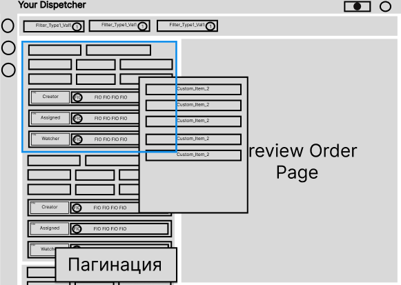

```tsx
import React from 'react';
import { Outlet, createRootRoute, createRoute, createRouter, createMemoryHistory, RouterProvider } from '@tanstack/react-router';
import { OrdersFilterProviderPrmt } from '@/primitives/OrdersFilterPrmt/OrdersFilterContextPrmt';
import { OrderListPreviewContainerPrmt } from '@/primitives/OrderListPreviewPrmt/OrderListPreviewContainerPrmt/OrderListPreviewContainerPrmt';
import { OrdersFilterClosedPrmt } from '@/primitives/OrdersFilterPrmt/OrdersFilterClosedPrmt/OrdersFilterClosedPrmt';
import { LayoutPrmt } from '@/primitives/LayoutPrmt/LayoutPrmt';
import { OrderListContainerPrmt } from '@/primitives/OrderListPreviewPrmt/OrderListContainerPrmt/OrderListContainerPrmt';
import { OrderListItemPrmt } from '@/primitives/OrderListPreviewPrmt/OrderListContainerPrmt/OrderListItemPrmt/OrderListItemPrmt';
import { OrderPrmt } from '@/primitives/OrderListPreviewPrmt/OrderPrmt/OrderPrmt';
import { OrdersFilterDesktopDialogPrmt } from '@/primitives/OrdersFilterPrmt/OrdersFilterDialogsPrmt/OrdersFilterDesktopDialogPrmt/OrdersFilterDesktopDialogPrmt';
import { ColPrmt } from '@/primitives/ColPrmt/ColPrmt';
import { PaginationPrmt as OrdersPaginationPrmt } from '@/primitives/PaginationPrmt/PaginationPrmt';

import { sidebarButtons, data, filters } from './data';
import { StyleguidistRouterWrapper, OutletComponent } from '@/StyleguidistWrapper';

const rootRoute = createRootRoute({
	component: function RootComponent() {
		return (
			<OrdersFilterProviderPrmt>
				<LayoutPrmt buttons={sidebarButtons} title="Caption" avatar={{ title: 'AV' }}>
					<OrdersFilterClosedPrmt open={false} dialog filters={filters} />
					<OrderListPreviewContainerPrmt height={160}>
						<ColPrmt span={12}>
							<OrderListContainerPrmt>
								<OrderListItemPrmt key={data[0].id} data={data[0]} />
								<OrderListItemPrmt key={data[1].id} data={data[1]} />
								<OrderListItemPrmt key={data[2].id} data={data[2]} />
								<OrderListItemPrmt key={data[3].id} data={data[3]} />
								<OrderListItemPrmt key={data[4].id} data={data[4]} />
								<OrderListItemPrmt key={data[5].id} data={null} />
							</OrderListContainerPrmt>
							<OrdersPaginationPrmt defaultCurrent={1} total={50} />
						</ColPrmt>
						<ColPrmt span={12}>
							<OrderPrmt />
						</ColPrmt>
					</OrderListPreviewContainerPrmt>
				</LayoutPrmt>
				<OutletComponent />
			</OrdersFilterProviderPrmt>
		);
	},
});

const IndexRoute = createRoute({
	getParentRoute: () => rootRoute,
	path: '/',
	component: function IndexComponent() {
		return <div />;
	},
});

const DialogRoute = createRoute({
	getParentRoute: () => rootRoute,
	path: '/dialog',
	component: function DialogComponent() {
		return <OrdersFilterDesktopDialogPrmt />;
	},
});

const routeTree = rootRoute.addChildren([IndexRoute, DialogRoute]);

const memoryHistory = createMemoryHistory({
	initialEntries: ['/'],
});

const router = createRouter({ routeTree, history: memoryHistory });

<StyleguidistRouterWrapper router={router} />;
```

